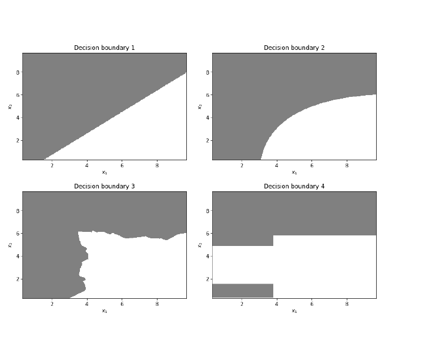

### Exam 2 Guidelines

- You have until the scheduled day of your final to complete this exam. Submit it as a knitted markdown PDF document in the appropriate dropbox in moodle. If you submit the solution as an .Rmd you will be penalized by taking 20 points off your grade.

- You are to work completely independently on the exam. You are allowed to use your class notes, moodle, worksheets, homeworks, textbooks, plus the "Help" feature from Rstudio.

- You **are not** permitted to do web searches.

- For questions that ask for interpretations and explanations, usually no more than a sentence or two is needed for justification.  Be thorough, but do not “brain dump”.

**PLEDGE:**  I pledge on my honor that I have neither received nor given assistance during this exam nor have I witnessed others receiving assistance, and I have followed the guidelines as described above.  

**PRINTED NAME:** 

$\bigcirc$ I have intentionally **not signed** the pledge.


```{r setup, echo=FALSE, warning=FALSE, message=FALSE}
knitr::opts_chunk$set(warning=FALSE, message=FALSE)
library(tidyverse)
library(tidymodels)
tidymodels_prefer()
```


## Trends in superbowl commercials (10 points)

For this exercise we will be using the following dataset, which contains information about the superbowl commercials

```{r}
superbowl.tbl <- read_csv("~/Mscs 341 S22/Class/Data/superbowl.csv")
```

The variable description of the dataset can be found at:

https://github.com/rfordatascience/tidytuesday/blob/master/data/2021/2021-03-02/readme.md#data-dictionary

In particular we are interested in the **characteristics** of the commercial which are encoded by the following columns:

* `animals`
* `celebrity`
* `danger`
* `funny`
* `patriotic`
* `show_product_quickly`

Use a linear model to establish how much each of these characteristics are changing through the years. What are your input and response variables and their types? According to your analysis, are commercials becoming less funny lately? Are they increasingly using more celebrities? Make sure to interpret the coefficients associated with each input variable of your linear model.

## Decision boundaries (10 points)

For each of the decision boundaries depicted in Figure 1, justify whether or not they can come from one of the following classifiers:

1. Logistic regression
2. Linear Discriminant Analysis (LDA).
3. Quadratic Discriminant Analysis (QDA).
4. k-Nearest Neighbor with $k=3$.
5. A decision tree of depth $2$
6. A random forest with $B=3$ trees, each of a maximum depth $3$

Notice that each classifier only uses $x_1$ and $x_2$ as inputs and that a particular decision boundary can originate from more than one classifier

{width=70%}


## Cats or dogs? (30 points) 

Consider the following dataset:

```{r}
image.tbl <- read.csv("~/Mscs 341 S22/Class/Data/cats_dogs.csv")
```

which contains the images of 99 cats and 99 dogs represented as 64 by 64 images. The first 4096 ($64 \times 64$) columns correspond to the pixels of the image, and the column `type` contains information of whether the image corresponds to a `cat` or a `dog`.

The function `plotImage` allows us to show an image represented in a matrix. Notice that we can use it to plot the images in our dataset by selecting the appropriate row and columns and converting into a matrix (see the examples below)

```{r fig.width=3, fig.height=3}
plotImage <- function(dat,size=64){
  imag <- matrix(dat,nrow=size,byrow=T) 
  image(imag,col=grey.colors(256)) 
}
#Plot the first image-dog
plotImage(as.matrix(image.tbl[1,1:4096]))
#Plot the 150th image-cat
plotImage(as.matrix(image.tbl[150,1:4096]))
```

Finally let's create training/testing datasets as well as 10-fold cross-validation dataset. Make sure to use these datasets in the following subsections.  

```{r}
set.seed(654321)
image.split <- initial_split(image.tbl, prop=0.6)
image.train.tbl <- training(image.split)
image.test.tbl <- testing(image.split)
images.folds <- vfold_cv(image.train.tbl, v = 10)
```


### LASSO model (10 points)

Describe in your own words what a LASSO model is and what the penalty term ($\lambda$) is. Create a LASSO model that distinguishes between cats and dogs by selecting an optimal penalty by using 10 fold cross-validation. Establish the accuracy and confusion matrix of the model using your testing dataset. Show two incorrectly classified images and their probabilities of being a dog or a cat assigned by the model.

### Random forest (10 points)

Describe in your own words what a random forest model is and what the parameter `mtry` refers to in the `ranger` implementation of random forests. Create a random forest model that distinguishes between cats and dogs by selecting an optimal value of `mtry` using 10 fold cross-validation. Establish the accuracy and confusion matrix of the model using your testing dataset. Show two incorrectly classified images and their probabilities of being a dog or a cat assigned by the model.

### Boosting (10 points)

Describe in your own words what a boosting model is and what the learning rate is in a boosting model. Create a boosting model that distinguishes between cats and dogs by selecting  an optimal learning rate using 10 fold cross-validation. Establish the accuracy and confusion matrix of the model. Show two incorrectly classified images and their probabilities of being a dog or a cat assigned by the model.

